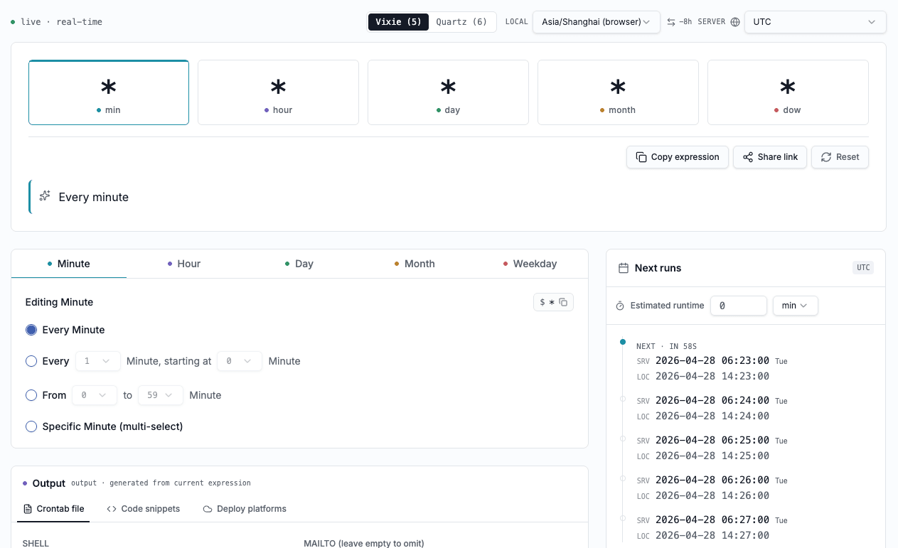

<p align="center">
  
</p>

<h1 align="center">crontab.cv</h1>

<p align="center">
  English | <a href="README.zh-CN.md">简体中文</a>
</p>

<p align="center">
  A visual, real-time, timezone-aware cron expression editor.<br/>
  Open source · No tracking · Works offline.
</p>

<p align="center">
  <a href="https://crontab.cv">Live Demo</a> ·
  <a href="https://crontab.cv/docs">Docs</a> ·
  <a href="https://github.com/chenz24/crontab.cv/issues">Report Bug</a> ·
  <a href="https://github.com/chenz24/crontab.cv/issues">Request Feature</a>
</p>

<p align="center">
  <a href="https://github.com/chenz24/crontab.cv/blob/main/LICENSE"></a>
  <a href="https://github.com/chenz24/crontab.cv/stargazers"></a>
  <a href="https://github.com/chenz24/crontab.cv/issues"></a>
</p>

<p align="center">
  
</p>

---

## Features

- **Visual Editor** — Click number grids to toggle values; ranges and lists are merged automatically.
- **Real-time Translation** — Instantly translates cron expressions into human-readable descriptions via [cronstrue](https://github.com/bradymholt/cronstrue).
- **Dual Cron Dialect** — Supports both 5-field POSIX/Vixie cron and 6-field Quartz cron (with `L` / `W` / `#` / `?` extensions).
- **Timezone Support** — Switch between server and local timezones; next 5 runs are computed in real time.
- **Multi-language Code Generation** — One-click code snippets for Crontab, Go, Node.js, Python, and Java (Spring).
- **Platform Configs** — Ready-to-paste configs for Kubernetes CronJob, GitHub Actions, GitLab CI, AWS EventBridge, Vercel Cron, Cloudflare Workers, and Spring `@Scheduled`.
- **Crontab File Builder** — Configure SHELL, MAILTO, command, log redirection and comments — generates a complete crontab file.
- **Duration & Overlap Detection** — Set estimated task runtime to visualize overlap warnings against the trigger interval.
- **URL Sharing** — Expression, timezone, and all options are encoded in the URL — copy the link to share with teammates.
- **i18n** — Available in English, 简体中文, 日本語, Français, Deutsch, and Español.
- **Light & Dark Theme** — Respects system preference with manual override.
- **Privacy First** — Everything runs client-side. No data is ever sent to a server. Works fully offline after first load.

## Tech Stack

| Layer | Technology |
|-------|-----------|
| Framework | [TanStack Start](https://tanstack.com/start) (SSR) + [React 19](https://react.dev) |
| Styling | [Tailwind CSS v4](https://tailwindcss.com) |
| UI Components | [shadcn/ui](https://ui.shadcn.com) + [Radix UI](https://www.radix-ui.com) |
| Cron Parsing | [cron-parser](https://github.com/harrisiirak/cron-parser) + [cronstrue](https://github.com/bradymholt/cronstrue) |
| Timezone | [date-fns-tz](https://github.com/marnusw/date-fns-tz) |
| State | [Zustand](https://github.com/pmndrs/zustand) |
| i18n | [Paraglide JS](https://inlang.com/m/gerre34r/library-inlang-paraglideJs) |
| Icons | [Lucide React](https://lucide.dev) |
| Linting | [Biome](https://biomejs.dev) |
| Deployment | [Cloudflare Workers](https://workers.cloudflare.com) via [@cloudflare/vite-plugin](https://github.com/cloudflare/workers-sdk) |

## Getting Started

### Prerequisites

- [Node.js](https://nodejs.org) >= 18
- [pnpm](https://pnpm.io) >= 9

### Installation

```bash
# Clone the repository
git clone https://github.com/chenz24/crontab.cv.git
cd crontab.cv

# Install dependencies
pnpm install
```

### Development

```bash
pnpm dev
```

The app will be available at `http://localhost:5173` (or the port shown in the terminal).

### Build

```bash
pnpm build
```

### Preview production build

```bash
pnpm preview
```

### Lint & Format

```bash
# Lint
pnpm lint

# Format
pnpm format

# Check & fix both
pnpm check
```

## Project Structure

```
crontab.cv/
├── messages/              # i18n message files (en, zh, ja, fr, de, es)
├── project.inlang/        # Paraglide / inlang config
├── src/
│   ├── components/
│   │   ├── crontab/       # Core editor components
│   │   │   ├── FieldModeEditor.tsx   # Mode-driven field editor (every/step/range/specific/quartz)
│   │   │   ├── OutputPanel.tsx       # Crontab file, code snippets & platform configs
│   │   │   ├── ValueGrid.tsx         # Clickable number grid
│   │   │   ├── DualTimeRow.tsx       # Server/local time display
│   │   │   ├── DurationBar.tsx       # Duration & overlap visualization
│   │   │   ├── TimezoneBar.tsx       # Timezone selector
│   │   │   ├── constants.ts          # Fields, presets, timezone list
│   │   │   └── utils.ts              # Pure helper functions
│   │   ├── ui/            # shadcn/ui primitives
│   │   ├── Crontab.tsx    # Main crontab editor orchestrator
│   │   ├── Header.tsx
│   │   └── Footer.tsx
│   ├── lib/
│   │   ├── cron-platforms.ts   # Platform-specific code generators
│   │   ├── i18n.tsx            # i18n hooks
│   │   └── utils.ts            # General utilities
│   ├── pages/
│   │   ├── HomePage.tsx        # Editor page (URL ↔ state sync)
│   │   ├── DocsPage.tsx        # Cron syntax reference
│   │   └── AboutPage.tsx       # About / FAQ
│   ├── router.tsx
│   └── styles.css
├── biome.json
├── vite.config.ts
├── wrangler.jsonc          # Cloudflare Workers config
└── package.json
```

## Supported Platforms

crontab.cv generates ready-to-use configs for:

| Platform | Output |
|----------|--------|
| Linux / macOS crontab | Complete crontab file with env vars & log redirection |
| Kubernetes CronJob | `cronjob.yaml` with `timeZone` and concurrency policy |
| GitHub Actions | `.github/workflows/schedule.yml` (auto-converted to UTC) |
| GitLab CI | `.gitlab-ci.yml` pipeline schedule |
| AWS EventBridge | Rule JSON + AWS CLI command |
| Vercel Cron | `vercel.json` (auto-converted to UTC) |
| Cloudflare Workers | `wrangler.toml` cron triggers |
| Spring `@Scheduled` | Java class with 6-field Quartz expression |

## Contributing

Contributions are welcome! Here's how you can help:

1. **Fork** the repository
2. **Create** a feature branch (`git checkout -b feat/amazing-feature`)
3. **Commit** your changes (`git commit -m 'feat: add amazing feature'`)
4. **Push** to the branch (`git push origin feat/amazing-feature`)
5. **Open** a Pull Request

### Adding a New Language

1. Create a new message file in `messages/` (e.g. `messages/ko.json`) based on `messages/en.json`.
2. Add the locale code to the `locales` array in `project.inlang/settings.json`.
3. Add the language option to the `LanguageSwitcher` component.

## License

Distributed under the **MIT License**. See [`LICENSE`](LICENSE) for more information.

## Acknowledgements

- [cronstrue](https://github.com/bradymholt/cronstrue) — Human-readable cron expression descriptions
- [cron-parser](https://github.com/harrisiirak/cron-parser) — Cron expression parsing and next-run computation
- [shadcn/ui](https://ui.shadcn.com) — Beautiful, accessible UI components
- [TanStack](https://tanstack.com) — Full-stack React framework and router
- [Paraglide JS](https://inlang.com/m/gerre34r/library-inlang-paraglideJs) — Typesafe i18n

## More Projects

- [easing.tools](https://easing.tools) — A visual playground for CSS easing and animation timing functions.
- [rename.tools](https://rename.tools) — Batch rename files quickly with practical pattern-based rules.
- [open-awesome.com](https://open-awesome.com) — Curated open-source tools and resources for developers.

---

<p align="center">
  If you find this tool useful, please consider giving it a ⭐ on <a href="https://github.com/chenz24/crontab.cv">GitHub</a>!
</p>
